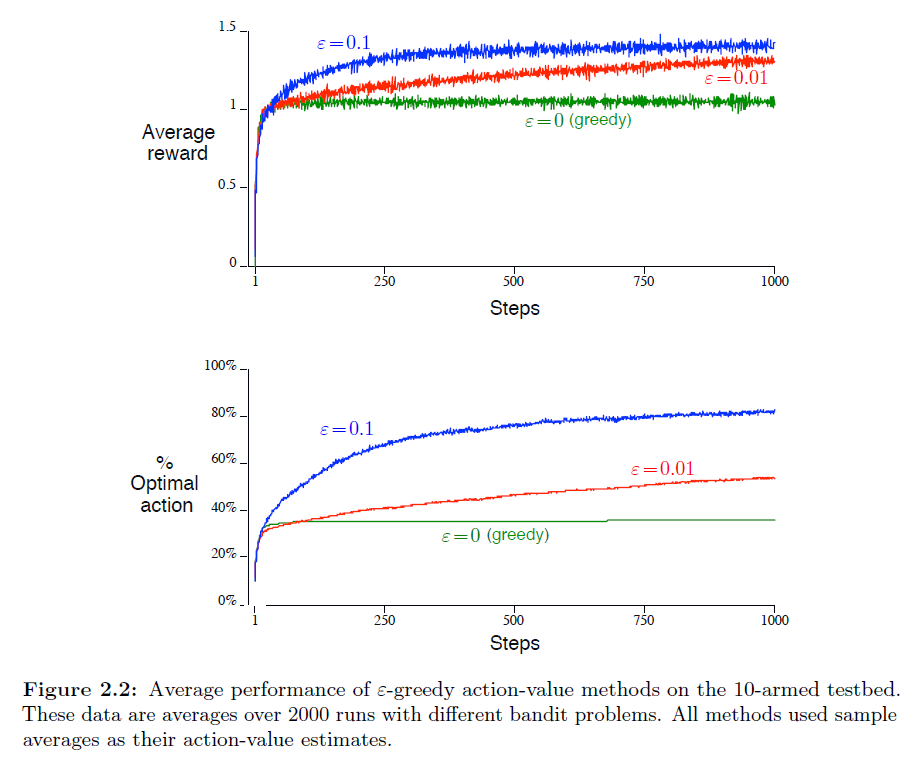

# 第二章 多臂赌博机 习题解答

## 练习2.1 $\varepsilon$-贪心算法
 
> 在$\varepsilon$-贪心动作选择中，对于两个动作且$\varepsilon=0.5$的情况，选择贪婪动作的概率是多少？

*解答：* $\varepsilon$表示采取随机动作的概率，故采取贪婪动作的概率为$1-\varepsilon=0.5$。

## 练习2.2 赌博机问题案例

> 考虑有$k=4$个动作（表示为1、2、3和4）的$k$-臂赌博机问题。
> 对此问题应用$\varepsilon$-贪婪策略选择动作、应用样本均值来估计动作价值、用$Q_1(A)=0$作为初始估计值。
> 假设动作和奖励的初始序列为$A_1=1$，$R_1=-1$，$A_2=2$，$R_2=1$，$A_3=2$，$R_3=-2$，$A_4=2$，$R_4=2$，$A_5=3$，$R_5=0$。
> 在这段时间中的一些时间点上，$\varepsilon$情况可能已经发生，导致随机选择动作。这肯定发生在哪个时间点？这种情况可能发生在哪些时间点？

*解答：* $A_4$和$A_5$肯定是随机选择，而$A_1$、$A_2$和$A_3$可能是随机选择的。
因为在$t=4$时刻，$Q_4(A_2)=\frac{1+(-2)}{2}=-0.5<0=Q_4(A_4)$，,贪心策略下不可能在该时刻选择动作2，故此时是随机选择的动作2；
在$t=5$时刻，$Q_5(A_2)=\frac{1+(-2)+(2)}{3}=0.33>0$，且其他动作的估计价值都不大于0，贪心策略下必须选择动作2，故此时是随机选择的动作3。

## 练习2.3 选择最佳$\varepsilon$
> 在图2.2所示的比较中，就累计回报和选择最佳操作的概率$\varepsilon$而言，哪种方法在长期内表现最好？
> 会有多好呢？ 量化地表达你的答案。

*解答：* 先说结论，$\varepsilon=0.01$时，长期回报和选择最佳操作的概率都最高。
设操作种类为$K$，总共操作数为$M$，假设$M$足够大（即长期操作），累计回报$R_{sum}$和选择最佳操作的概率$p_{best}$可由如下公式得：

$$
R_{sum}=M\times(Q_{best}(A) + \varepsilon\times(Q_{random}(A)-Q_{best}(A))) 
$$

$$
p_{best}=1-\frac{\varepsilon}{K}
$$

易知当$\varepsilon$减小，长期操作下的累计回报逐渐上升，且选择最佳操作的概率也提升。

## 练习2.4 
> 如果步长参数$\alpha_n$不是常数，则估计$Q_n$是先前收到的奖励的加权平均值，其权重不同于(2.6)所给出的权重。
> 就步长参数序列而言，一般情况下(类似于(2.6))每个先前奖励的权重是多少？

*解答：* 