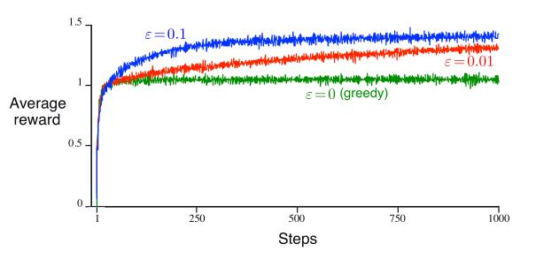

 # 第一章 导论 习题解答

两个玩家轮流在一个3$\times$3的棋盘上下棋，一方下X,一方下O，直到其中的一方在行、列或者对角线上占据三个子（如上图的X玩家），则该方获胜。如果棋盘被占满后没有任何一方有连续三个连着的棋子，那么游戏为平局。

## 练习1.1 左右互搏

> 假设上面的的强化学习算法不是对战随机对手，二是以左右互搏的方式与自己对战来训练自己。你认为这种情况下会发生怎样的事情？它是否会学习到不同的策略？

*解答：* 强化学习以左右互搏的方式自己与自己对战过程中，相比与随机对手，智能体将持续自我学习，并且最终达成平局。它可以学习到不同的策略并且极有可能比对战随机对手获得更高的智能。

 ## 练习1.2 对称性

> 由于对称性，井字棋的很多位置看起来不同但其实是相同的。我们如何利用这一点来修改上面提到的学习过程呢？这种改变会怎样改善学习过程？假设对方没有利用对称性，那我们应该利用吗？对称相等的位置是否必然具有相同的价值呢？

*解答：* 在井字棋游戏中，可以沿着x和y坐标中点进行横竖折叠，即左右，上下对称。这将有有助于降低算法的空间复杂度，并且提升学习过程的效率。如果对手没有利用对称性，那么我们也不应该利用，因为我们无法从这样的优势（单方面利用对称性）中获得更有效的学习。对称等价的位置在博弈游戏中并不一定具有相同的价值。

 ## 练习1.3 贪心策略

> 假设强化学习的玩家是贪心的，也就是说，他总是把棋子移动到他任务最好的位置，而从不进行试探。比起一个非贪心的玩家，他会玩得更好，还更差呢？可能会出现什么问题？

*解答：* 通常会更差。因为贪心策略的玩家不能够从长期的新的行为探索中获得更优的收益。一个智能体学习过程是在探索新的行为以获得长期累积收益最大和每次仅做出对当前行为收益最大的二者之间的权衡，如原书图2-2所示。 但是如果贪心算法能够确定获得每一个状态的情况，那么贪心就能够直接获得最优收益，当前我们面对的实际问题大多都不是这样的情况。

 ## 练习1.4 从试探中学习

> 假设学习更新发生在包括试探动作在内的所有动作之后，如果步长参数随着时间而适当减小(试探的趋势并不减弱)，那么状态的价值将收敛到一组概率。我们从试探性的行动中学习，或者不从中学习，计算出两组概率(从概念上说)，分别会是什么？假设我们继续进行试探性行动，哪一组概率对学习来说可能更好？哪一组更可能带来更大的胜率？

*解答：* 假设不从试探中学习，那么我们每一步都做出当前最优的决策。如果我们从试探中学习，则在每一步中增加新动作的尝试的概率。通常在学习更新发生在包括试探动作在内的所有动作之后的情况下，第一种学习方法可能更好，因为它避免了动作收益曲线的波动，更容易带来更大的胜率。

 ## 练习1.5 其他提升方法

> 你能想出其他方法来提升强化学习的玩家能力吗？你能想出更好的方法来解决井字棋的问题吗？

