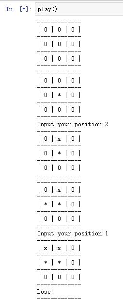

# 第一章 导论 案例“井字棋”小游戏


> 回顾：井字棋，两个玩家轮流在一个3$\times$3的棋盘上下棋，一方下X,一方下O，直到其中的一方在行、列或者对角线上占据三个子（如上图的X玩家），则该方获胜。如果棋盘被占满后没有任何一方有连续三个连着的棋子，那么游戏为平局。

这个游戏很简单，已经有很多成熟的解法，比如博弈论，动态规划，经典的优化方法，进化算法等。本案例中使用强化学习中的时序差分学习方法。即更新策略为
$$V(S_t) \leftarrow V(S_t) + \alpha\[V(S_{t+1}-V(S_t))\] $$
其中$\alpha$是一个很小的正分数，成为步长参数，影响学习速率。在每一个步骤中，价值变化的部分依赖于两个不同时刻的状态的价值的差。

## 代码说明

> 待完善

首先定义状态类，包括棋局的状态的保存，结束的判断等功能

```python
class State:
    def __init__(self):
        # the board is represented by a n * n array,
        # 1 represents chessman of the player who moves first,
        # -1 represents chessman of another player
        # 0 represents empty position
        self.data = np.zeros((BOARD_ROWS, BOARD_COLS))
        self.winner = None
        self.hashVal = None
        self.end = None

    # calculate the hash value for one state, it's unique
    def getHash(self):
        if self.hashVal is None:
            self.hashVal = 0
            for i in self.data.reshape(BOARD_ROWS * BOARD_COLS):
                if i == -1:
                    i = 2
                self.hashVal = self.hashVal * 3 + i
        return int(self.hashVal)

    # determine whether a player has won the game, or it's a tie
    def isEnd(self):
        if self.end is not None:
            return self.end
        results = []
        # check row
        for i in range(0, BOARD_ROWS):
            results.append(np.sum(self.data[i, :]))
        # check columns
        for i in range(0, BOARD_COLS):
            results.append(np.sum(self.data[:, i]))

        # check diagonals
        results.append(0)
        for i in range(0, BOARD_ROWS):
            results[-1] += self.data[i, i]
        results.append(0)
        for i in range(0, BOARD_ROWS):
            results[-1] += self.data[i, BOARD_ROWS - 1 - i]

        for result in results:
            if result == 3:
                self.winner = 1
                self.end = True
                return self.end
            if result == -3:
                self.winner = -1
                self.end = True
                return self.end

        # whether it's a tie
        sum = np.sum(np.abs(self.data))
        if sum == BOARD_ROWS * BOARD_COLS:
            self.winner = 0
            self.end = True
            return self.end

        # game is still going on
        self.end = False
        return self.end

    # @symbol 1 or -1
    # put chessman symbol in position (i, j)
    def nextState(self, i, j, symbol):
        newState = State()
        newState.data = np.copy(self.data)
        newState.data[i, j] = symbol
        return newState

    # print the board
    def show(self):
        for i in range(0, BOARD_ROWS):
            print('-------------')
            out = '| '
            for j in range(0, BOARD_COLS):
                if self.data[i, j] == 1:
                    token = '*'
                if self.data[i, j] == 0:
                    token = '0'
                if self.data[i, j] == -1:
                    token = 'x'
                out += token + ' | '
            print(out)
        print('-------------')
```

> 剩余说明更新中。。。

完整代码地址：[查看完整代码](src/TicTacToe.ipynb)

## 运行效果


